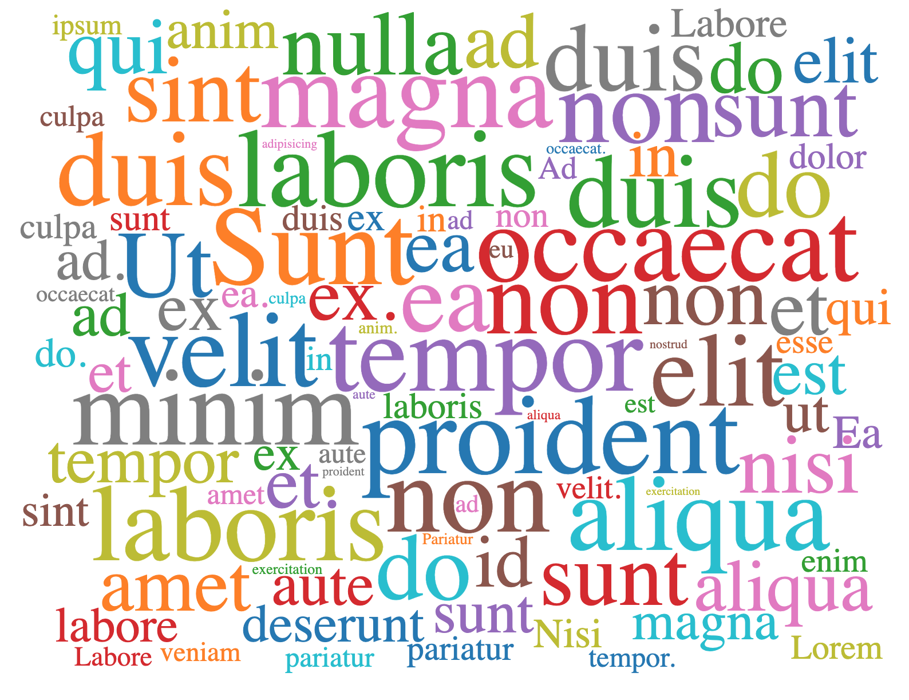

# Angular D3 Word Cloud
D3 Cloud component for Angular built upon d3-cloud

## This version require Angular CLI 15

## Previous versions

<details>
  <summary>Click to expand</summary>

- [Version 1.3.0](https://github.com/Talentia-Software-OSS/d3-cloud-angular/tree/1.3.x)

</details>



# Installation
```
npm install --save @talentia/angular-d3-cloud@1.4.1
```
# Usage
First import the package to your app module
```ts
// app.module.ts
import { AngularD3CloudModule } from '@talentia/angular-d3-cloud';

@NgModule({
  imports: [
    AngularD3CloudModule
  ],
  ...
})
```
Now the component is ready to use.

```html
<!-- app.component.html -->
<angular-d3-cloud [data]="data"></angular-d3-cloud>
```
```ts
// app.component.ts
export class AppComponent implements OnInit {
   @Input() data!: AngularD3Word[];

  private words = ['Exercitation', 'duis', 'ex', 'laboris', 'laboris', 'est', 'aliqua', 'Lorem', 'veniam', 'ad.', 'Minim', 'aliqua', 'enim', 'do', 'exercitation', 'duis', 'eiusmod', 'sunt', 'do', 'exercitation', 'qui', 'ex.', 'Aliqua', 'velit', 'sunt', 'in', 'commodo', 'anim.', 'Sunt', 'labore', 'sunt', 'dolor', 'exercitation', 'non', 'commodo', 'laboris', 'culpa', 'culpa', 'exercitation', 'ex', 'proident', 'laborum.\n\nId', 'dolore', 'commodo', 'occaecat', 'in', 'velit.', 'Aliqua', 'mollit', 'ea', 'qui', 'ad', 'aute', 'est', 'excepteur', 'non', 'aliqua', 'occaecat', 'ad', 'non', 'ea.', 'Labore', 'incididunt', 'excepteur', 'tempor', 'culpa', 'proident', 'ex', 'commodo.', 'Nisi', 'nostrud', 'tempor', 'deserunt', 'ipsum', 'adipisicing', 'aute', 'do', 'adipisicing.\n\nOfficia', 'pariatur', 'eiusmod', 'tempor', 'magna', 'occaecat.', 'Ut', 'proident', 'anim', 'aute', 'aliquip', 'pariatur', 'et.', 'Pariatur', 'ad', 'ea', 'sint', 'ut', 'excepteur', 'amet', 'id', 'do.', 'Labore', 'eu', 'velit', 'non', 'cillum', 'nulla.\n\nIncididunt', 'duis', 'tempor', 'sunt', 'dolor', 'magna', 'occaecat', 'esse', 'elit', 'consequat.', 'Ea', 'sint', 'et', 'labore', 'amet', 'ullamco', 'non', 'tempor.', 'Ad', 'voluptate', 'nisi', 'duis', 'minim', 'elit', 'in', 'adipisicing', 'et', 'laboris', 'nulla', 'culpa', 'ad'];

  ngOnInit(): void {
    this.refresh();
  } 

  refresh(): void {
    this.data = this.words.map((word) => {
      return { text: word, value: 10 + Math.random() * 90 };
    });
  }
}
```
# Props
| Name           | Description                                                                                                | Type                                          | Required | Default             |
|----------------|------------------------------------------------------------------------------------------------------------|-----------------------------------------------|----------|---------------------|
| data           | The input data for rendering                                                                               | Array<{ text: string, value: number }>        |     ✓    |                     |
| width          | Width of component (px)                                                                                    | number                                        |          | 700                 |
| height         | Height of component (px)                                                                                   | number                                        |          | 600                 |
| fontSizeMapper | Map each element of data to font size (px)                                                                 | Function: (word: string, idx: number): number |          | word => word.value; |
| rotate         | Map each element of data to font rotation degree. Or simply provide a number for global rotation. (degree) | Function \| number                            |          | 0                   |
| padding        | Map each element of data to font padding. Or simply provide a number for global padding. (px)              | Function \| number                            |          | 5                   |
| font           | The font of text shown                                                                                     | Function \| string                            |          | serif               |
| fontWeight | Weight of the font | string \| number |          |  'normal' |
| autoFill       | Whether texts should be fill with random color or not                                                      | boolean                                       |          | false               |
| fillMapper | Function used by autoFill to map each data item to a fill color. Can be used to customize the way autoFill generate colors | Function: (word: Word, index: number): string |          | A function based on schemeCategory10 of d3-scale-chromatic|
| animations | Whether animated transitions is active or not | boolean |          |  false |
# Events
| Name          | Description                                              | Payload                           |
|---------------|----------------------------------------------------------|-----------------------------------|
| wordClick     | Event triggered when click event triggered on a word     | { event: MouseEvent, word: Word } |
| wordMouseOver | Event triggered when mouseover event triggered on a word | { event: MouseEvent, word: Word } |
| wordMouseOut  | Event triggered when mouseout event triggered on a word  | { event: MouseEvent, word: Word } |

> The `Word` interface imported from `d3-cloud`
# Example
Run the following commands to start sample project:
```
npm start
```
# Thanks
This project is built with the idea of [React D3 Cloud](https://github.com/Yoctol/react-d3-cloud).  
This project is forked from [maitrungduc1410/d3-cloud-angular](https://github.com/maitrungduc1410/d3-cloud-angular).
